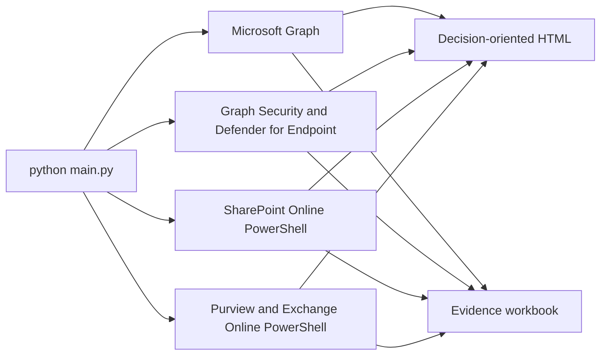

# Enterprise AI Readiness Assessment for the Microsoft 365 Data Estate

This read-only assessment evaluates the Microsoft 365 foundation used by Microsoft 365 Copilot, AI agents, and external AI products that connect to tenant data. It separates security and data readiness from product adoption, optional extensibility, and provider approval.

The report produces three distinct conclusions:

- Microsoft 365 foundation readiness.
- Approval status for each proposed AI provider and subscription tier.
- Readiness of each named AI use case.

Provider and use-case conclusions require an assessment profile and provider evidence. Without those inputs, the tool concludes only on the Microsoft 365 foundation; it does not automatically approve ChatGPT, Claude, Cursor, or another external service.

## What the default assessment reads



The normal full run collects supported evidence for:

- Tenant identity, licenses, Copilot usage, Microsoft 365 Apps usage, and workload context.
- Conditional Access, authentication methods, privileged roles, consent grants, access reviews, managed devices, and audit evidence.
- Enterprise applications and Microsoft Graph external connections used as grounding sources or Copilot connectors.
- Graph Security alerts, incidents, Secure Score, and Defender for Endpoint onboarding/risk inventory.
- SharePoint and OneDrive sharing defaults, anonymous-link behavior, site deviations, legacy authentication, and existing Data Access Governance report status.
- Purview DLP policies and rules, sensitivity labels and policies, retention, rights management, and audit configuration.

The assessment never starts a Microsoft scan, report, site review, export, or remediation action.

## Authentication model

Graph, Defender, and selected REST collectors use the configured application certificate or client secret. The runtime uses a small `azure-identity` and `httpx` Graph client; the generated Microsoft Graph SDK is not required.

SharePoint administrative PowerShell cannot use a client secret. SharePoint and supported Purview cmdlets prefer application certificate authentication and otherwise announce and request a delegated browser sign-in. `SHAREPOINT_ADMIN_URL` is optional and is normally derived from the tenant’s initial `.onmicrosoft.com` domain.

Run the idempotent setup and connection preflight:

```powershell
.\setup-service-principal.ps1 -Mode Standard
python main.py --check-connections
python main.py
```

See [prereq.md](prereq.md) for the exact permission, role, certificate, module, and licensing requirements. See [RUN.md](RUN.md) for all command-line examples.

## SharePoint oversharing and Purview data risk

The live SharePoint collector reads tenant/site sharing settings and checks whether existing Data Access Governance reports are completed and recent. It can reuse completed downloadable results for permission-state, Everyone/EEEU, sharing-link, and supported Copilot app insight coverage.

SharePoint Advanced Management DAG and Microsoft Purview DSPM are authoritative sources for deeper data-exposure conclusions. Supply existing exports when they are not available through the live collector:

```powershell
python main.py `
  --sam-report .\exports\sharepoint-dag.csv `
  --dspm-report .\exports\dspm.csv
```

When a needed report is missing or stale, the HTML places a concise action near the decision explaining what to run, prerequisites, expected duration, and how to reassess. Missing evidence is never reported as zero exposure or a healthy result.

## AI adoption and value evidence

The report distinguishes:

- License coverage: licensed users divided by eligible users.
- Activation: active Copilot users divided by enabled users.
- Engagement: prompts, active days, applications used, and trend.
- Microsoft 365 app readiness: workload and platform use that helps select a pilot population.
- Extensibility: agents, connectors, and Power Platform inventory.
- External AI: aggregate activity observed through an approved discovery source.

Copilot metrics use Microsoft’s actual returned period and refresh date. D28 means the rolling last 28 days and is displayed as “Last 28 days” in the report. Missing periods are not substituted with zero.

Optional deeper evidence:

```powershell
python main.py --include-user-usage-detail
python main.py --copilot-dashboard-export .\exports\copilot-dashboard.csv
python main.py --power-platform-inventory .\exports\power-platform-inventory.csv
```

User-level Copilot activity is opt-in and appears only in the restricted workbook, never in HTML.

## Optional and preview collectors

Power Platform Inventory API, Defender Cloud Apps Shadow AI discovery, and Global Secure Access are opt-in. They are supplemental and cannot change the core Microsoft 365 foundation decision.

```powershell
python main.py --preview-collectors power-platform
python main.py --preview-collectors shadow-ai
python main.py --preview-collectors network-access
```

The old Az.Accounts-based Power Platform path runs only with:

```powershell
python main.py --legacy-power-platform-collector
```

Ordinary Office network traffic, file activity, or inbound email is not treated as proof of Copilot or external-AI use.

## Cross-provider and use-case assessment

```powershell
python main.py `
  --assessment-profile .\examples\assessment-profile.example.json `
  --provider-evidence .\examples\provider-evidence.example.csv
```

- `--assessment-profile` supplies proposed products, tiers, users, use cases, data boundaries, actions, human approvals, and outcome measures.
- `--provider-evidence` supplies the product-and-tier review register. It is stale after 90 days by default; change `PROVIDER_EVIDENCE_MAX_AGE_DAYS` if required.
- `--baseline` compares stable finding fingerprints with a prior workbook or snapshot.
- `--snapshot-json` writes an optional automation artifact; no snapshot is created by default.

## Outputs

Every assessment creates:

- A concise HTML report led by the decision, required actions, what the tenant is doing well, adoption/value evidence, and decision-limiting data gaps.
- An Excel evidence workbook by default. CSV is available with `--report-format csv`; `--report-format both` creates Excel and CSV.

The main HTML keeps technical permissions, module paths, URLs, collector status, and engineer evidence in collapsible sections. The workbook begins with the Action Plan, Evidence Index, and Collection Coverage, followed by evidence tabs and the full Recommendations register.

Reports, environment files, caches, and credentials are excluded by `.gitignore`.

## Quality and methodology

The exporter checks for contradictory counts, malformed evidence, truncated required sources, unresolved GUIDs in name fields, unsupported high-confidence conclusions, privacy leakage, and cross-output consistency. A report that fails the integrity gate remains available for diagnosis but is marked unsuitable for deployment approval.

See [METHODOLOGY.md](METHODOLOGY.md) for control definitions, evidence standards, scope boundaries, and comparison rules.

## Start here

1. Read [prereq.md](prereq.md).
2. Run `setup-service-principal.ps1`.
3. Run `python main.py --check-connections`.
4. Run `python main.py`.
