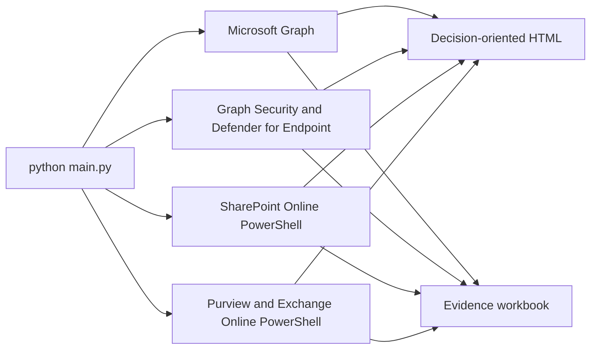

# Microsoft 365 Copilot Readiness Assessment

This read-only assessment helps business leaders and IT owners decide what must be addressed or confirmed before a Microsoft 365 Copilot pilot expands. It combines tenant evidence, saved collections and Microsoft portal exports into one customer HTML report and a technical evidence workbook. Agents and external AI products are included when explicitly scoped.

The report produces three distinct conclusions:

- Microsoft 365 foundation readiness.
- Approval status for each proposed AI provider and subscription tier.
- Readiness of each named AI use case.

Provider and use-case conclusions require an assessment profile and provider evidence. Without those inputs, the tool concludes only on the Microsoft 365 foundation; it does not automatically approve ChatGPT, Claude, Cursor, or another external service.

## What the default assessment reads



The normal full run collects supported evidence for:

- Tenant identity, licenses, Copilot usage, Microsoft 365 Apps usage, and workload context.
- Conditional Access, authentication methods, privileged roles, consent grants, access reviews, managed devices, and audit evidence.
- Enterprise applications and Microsoft Graph external connections used as grounding sources or Copilot connectors.
- Graph Security alerts, incidents, Secure Score, and Defender for Endpoint onboarding/risk inventory.
- SharePoint and OneDrive sharing defaults, anonymous-link behavior, site deviations, legacy authentication, and existing Data Access Governance report status.
- Purview DLP policies and rules, sensitivity labels and policies, retention, rights management, and audit configuration.

The assessment never starts a Microsoft scan, report, site review, export, or remediation action.

## Authentication model

Graph, Defender, and selected REST collectors use the configured application certificate or client secret. The runtime uses a small `azure-identity` and `httpx` Graph client; the generated Microsoft Graph SDK is not required.

SharePoint administrative PowerShell cannot use a client secret. SharePoint and supported Purview cmdlets prefer application certificate authentication and otherwise announce and request a delegated browser sign-in. `SHAREPOINT_ADMIN_URL` is optional and is normally derived from the tenant’s initial `.onmicrosoft.com` domain.

Run the idempotent setup and connection preflight:

```powershell
.\setup-service-principal.ps1 -Mode Standard
python main.py --check-connections
python main.py
```

Use [RUN.md](RUN.md) as the canonical operator runbook: prepare, collect and save, add exports, rebuild and review. [prereq.md](prereq.md) covers connected access and setup; [the portal guide](PORTAL_REPORTS_AND_OFFLINE.md) covers report requests and validated export schemas.

## Collect once, then rebuild offline

To preview HTML and Excel immediately using the repository's synthetic report samples, run:

```powershell
python main.py --mode offline --reports-dir .\tests\fixtures\microsoft_reports --tenant-name "Sample tenant"
```

This preview requires no tenant collection and identifies unassessed tenant controls. Select `--mode live` for tenant collection or `--mode offline` for local report generation. The older `--offline` flag remains an alias. Without a mode, `--collection-input`, `--prior-report`, or `--purview-cache` selects offline; otherwise the existing live default is retained.

Every live assessment automatically saves a reusable tenant collection and a portable assessment folder. At the end, **COLLECTION INPUT (`--collection-input`)** shows the exact file to reuse and a copyable offline command. Use that path to combine the run with portal exports later:

```powershell
python main.py --mode live
# Replace <collection-input> with the full path from the final console handoff.
python main.py --mode offline --collection-input "<collection-input>" --reports-dir .\exports
```

Collections use a unique filename under `output/collections/`: `tenant-collection_<tenant>_<UTC timestamp>_<unique id>.json`. Use the **COLLECTION INPUT** path shown by the console, which points to the reusable collection or rebuild recipe for that assessment. `--save-collection PATH` is an optional override for a custom destination, such as `python main.py --mode live --save-collection .\output\customer\tenant-collection.json`. Connection preflight (`--check-connections`) does not save a collection; offline mode does not save or overwrite one.

The offline command builds HTML and Excel without tenant authentication, network calls, or administrative PowerShell. The adjacent `<collection-stem>_package` folder preserves `collection.json`, original supplemental inputs, assessment settings, deliverables and an operator log. Copy that entire folder and rebuild using its `collection.json`; original cache/download paths are unnecessary. If exports are available during the live run, include `--reports-dir` then. The package restores those inputs on replay; use `--reports-dir` to add later exports. See [RUN.md](RUN.md#portable-assessment-folder) for the package layout and replay rules.

Original collection dates remain unchanged. The recorded evaluation date controls freshness; `--evaluation-date YYYY-MM-DD` deliberately reassesses saved evidence as of another date. User-level workbook detail still requires `--include-user-usage-detail` on each run. To review exports before a collection is available, use `python main.py --mode offline --reports-dir .\exports`; tenant controls are explicitly unassessed.

The replayable collection is different from `--snapshot-json`, which stores assessment results for comparison. To combine older tenant evidence with new exports without another live run, add `--prior-report Reports/prior.xlsx` and, if available, `--purview-cache .cache/purview/saved.json`. Historical findings join their relevant domains and confirmation actions, retaining original dates; the full original register remains in workbook tabs. A Purview cache supplies configuration only. These inputs cannot reconstruct raw data that was never saved. Treat the entire assessment package as confidential tenant data.

Successful historical or portal-only builds also create a portable folder under `output/assessments/`, using `rebuild.json` instead of a collection. Copy the whole folder and use `--collection-input PATH\rebuild.json` to restore the saved inputs automatically. Offline builds never create an artificial tenant collection.

See [Portal reports and offline reporting](PORTAL_REPORTS_AND_OFFLINE.md) for supported export schemas, report requests, permissions, licensing, and a customer email template.

Include admin-center PDFs in [`--reports-dir`](PORTAL_REVIEW.md), including PDF subfolders. The tool automatically creates JSON, extracts text locally (Windows OCR for image pages), and embeds page previews and originals. The package preserves these for replay. Extracted context does not automatically satisfy a readiness control; `--portal-review` remains available for curated review notes.

Live collection includes paid Copilot prompt aggregates, subscription seat counts and returned Copilot DLP targeting/actions. Request only remaining relevant portal details instead of routinely exporting three PDFs. See [automatic Copilot collection coverage](COPILOT_AUTOMATIC_COLLECTION.md).

### Console detail and colors

Default output keeps progress, warnings, the decision, action counts and output paths visible. Add `--verbose` (or `-v`) for processing details, source provenance, actions by assessment area and input receipts. The workbook and structured operator log retain detailed results in either mode.

Color defaults to `--color auto`: interactive terminals use color; redirected output and `NO_COLOR` use plain text. `--color never` disables it, and `--color always` explicitly forces it. See [the console workflow](RUN.md#read-the-console-and-copy-the-next-command) for examples.

## SharePoint oversharing and Purview data risk

The live SharePoint collector reads tenant/site sharing settings and checks whether existing Data Access Governance reports are completed and recent. It can reuse completed downloadable results for permission-state, Everyone/EEEU, sharing-link, and supported Copilot app insight coverage.

SharePoint Advanced Management DAG and Microsoft Purview DSPM are authoritative sources for deeper data-exposure conclusions. Supply existing exports when they are not available through the live collector:

```powershell
python main.py `
  --sam-report .\exports\sharepoint-dag.csv `
  --dspm-report .\exports\dspm.csv
```

When a needed report is missing or stale, the HTML places a concise action near the decision explaining what to run, prerequisites, expected duration, and how to reassess. Missing evidence is never reported as zero exposure or a healthy result.

## AI adoption and value evidence

The report distinguishes:

- License coverage: licensed users divided by eligible users.
- Activation: active Copilot users divided by enabled users.
- Engagement: prompts, active days, applications used, and trend.
- Microsoft 365 app readiness: workload and platform use that helps select a pilot population.
- Extensibility: agents, connectors, and Power Platform inventory.
- External AI: aggregate activity observed through an approved discovery source.

Copilot metrics use Microsoft’s actual returned period and refresh date. D28 means the rolling last 28 days and is displayed as “Last 28 days” in the report. Missing periods are not substituted with zero.

Optional deeper evidence:

```powershell
python main.py --include-user-usage-detail
python main.py --copilot-dashboard-export .\exports\copilot-dashboard.csv
python main.py --power-platform-inventory .\exports\power-platform-inventory.csv
```

User-level Copilot activity is opt-in and appears only in the restricted workbook, never in HTML.

## Optional and preview collectors

Power Platform Inventory API, Defender Cloud Apps Shadow AI discovery, and Global Secure Access are opt-in. They are supplemental and cannot change the core Microsoft 365 foundation decision.

```powershell
python main.py --preview-collectors power-platform
python main.py --preview-collectors shadow-ai
python main.py --preview-collectors network-access
```

The old Az.Accounts-based Power Platform path runs only with:

```powershell
python main.py --legacy-power-platform-collector
```

Ordinary Office network traffic, file activity, or inbound email is not treated as proof of Copilot or external-AI use.

## Cross-provider and use-case assessment

```powershell
python main.py `
  --assessment-profile .\examples\assessment-profile.example.json `
  --provider-evidence .\examples\provider-evidence.example.csv
```

- `--assessment-profile` supplies proposed products, tiers, users, use cases, data boundaries, actions, human approvals, and outcome measures.
- `--provider-evidence` supplies the product-and-tier review register. It is stale after 90 days by default; change `PROVIDER_EVIDENCE_MAX_AGE_DAYS` if required.
- `--baseline` compares stable finding fingerprints with a prior workbook or snapshot.
- `--snapshot-json` writes an optional automation artifact; no snapshot is created by default.

## Outputs

Every assessment creates:

- A concise HTML report led by the decision, required actions, what the tenant is doing well, adoption/value evidence, and decision-limiting data gaps.
- An Excel evidence workbook by default. CSV is available with `--report-format csv`; `--report-format both` creates Excel and CSV.

Every live assessment also saves a collection JSON and portable assessment folder for offline reuse. Preflight-only checks and offline builds do not create or overwrite a collection.

The HTML follows one narrative: executive assessment, prioritized action plan, readiness by assessment area, rollout conditions, remaining evidence and decisions, and technical appendix. Technical source details and the original historical register remain available in the workbook. Missing evidence never becomes a measured zero, and offline execution alone does not determine readiness.

Reports, environment files, caches, and credentials are excluded by `.gitignore`.

## Quality and methodology

The exporter checks for contradictory counts, malformed evidence, truncated required sources, unresolved GUIDs in name fields, unsupported high-confidence conclusions, privacy leakage, and cross-output consistency. A report that fails the integrity gate remains available for diagnosis but is marked unsuitable for deployment approval.

See [METHODOLOGY.md](METHODOLOGY.md) for control definitions, evidence standards, scope boundaries, and comparison rules.

## Start here

Follow [RUN.md](RUN.md) for the supported collection and replay workflow. For a local preview, start with the synthetic offline command above.
