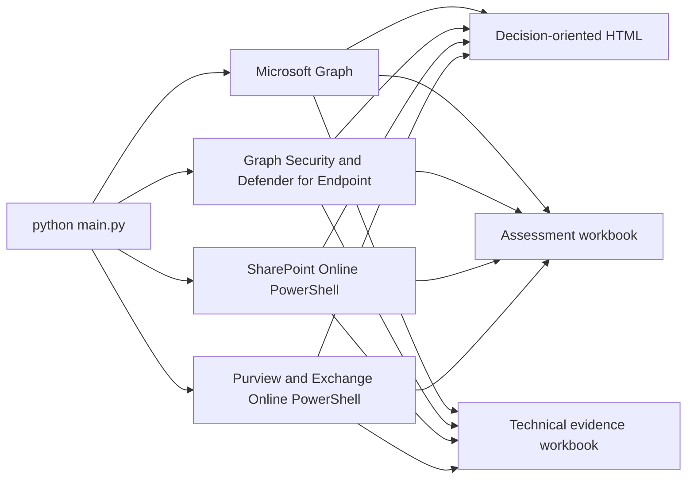

# AI Readiness and Microsoft 365 Hardening

This read-only assessment reviews AI readiness and Microsoft 365 tenant hardening, helping business leaders and IT owners decide what must be addressed or confirmed before a Microsoft 365 Copilot pilot expands. It combines tenant evidence, saved collections and Microsoft portal exports into a customer HTML report, an assessment workbook and a technical evidence workbook. Agents and external AI products are included when explicitly scoped.

**Start here:** [Operator runbook](docs/RUN.md) | [Customer checklist](docs/NEW_TENANT_CHECKLIST.md) | [All documentation](docs/README.md)

The report produces three distinct conclusions:

- Microsoft 365 foundation readiness.
- Approval status for each proposed AI provider and subscription tier.
- Readiness of each named AI use case.

Provider and use-case conclusions require an assessment profile and provider evidence. Without those inputs, the tool concludes only on the Microsoft 365 foundation; it does not automatically approve ChatGPT, Claude, Cursor, or another external service.

## What the default assessment reads


```mermaid
flowchart LR
    A[python main.py] --> B[Microsoft Graph]
    A --> C[Graph Security and Defender for Endpoint]
    A --> D[SharePoint Online PowerShell]
    A --> E[Purview and Exchange Online PowerShell]
    B --> F[Decision-oriented HTML]
    C --> F
    D --> F
    E --> F
    B --> G[Assessment workbook]
    B --> J[Technical evidence workbook]
    C --> G
    D --> G
    E --> G
    C --> J
    D --> J
    E --> J
```

The normal full run collects supported evidence for:

- Tenant identity, licenses, Copilot usage, Microsoft 365 Apps usage, and workload context.
- Conditional Access, authentication methods, privileged roles, consent grants, access reviews, managed devices, and audit evidence.
- Enterprise applications and Microsoft Graph external connections used as grounding sources or Copilot connectors.
- Graph Security alerts, incidents, Secure Score, and Defender for Endpoint onboarding/risk inventory.
- SharePoint and OneDrive sharing defaults, anonymous-link behavior, site deviations, legacy authentication, and existing Data Access Governance report status.
- Purview DLP policies and rules, sensitivity labels and policies, retention, rights management, and audit configuration.

The assessment never starts a Microsoft scan, report, site review, export, or remediation action.

The identity section includes [MFA method strength and defaults](docs/MFA_METHODS.md): registered methods, phone-only MFA registration, phishing-resistant registrations, user-selected defaults, system preferences, and member/guest/administrator breakdowns. These use the existing Graph registration report; no PDF export or additional endpoint is needed.

## Authentication model

The assessment runs on **application permissions first** and can run end to end with a client secret and no signed-in administrator:

- Graph, Defender, and selected REST collectors use the configured application certificate or client secret. The runtime uses a small `azure-identity` and `httpx` Graph client; the generated Microsoft Graph SDK is not required.
- SharePoint tenant sharing settings, sensitivity label definitions and the report privacy setting are read through Microsoft Graph application permissions.
- Purview and Exchange configuration (DLP, retention, label policies, audit) is read through PowerShell with an application access token from the same credential. Standard setup requests `Exchange.ManageAsApp` and assigns Global Reader by default, granting broad tenant read access. `-WorkloadRbac SecurityReader`, `None` and `RoleGroups` remain explicit alternatives; see [workload roles](docs/PERMISSIONS.md#workload-roles-for-app-only-purview-and-exchange).
- SharePoint administration (per-site settings, Data Access Governance reports) needs a certificate (`-EnableSharePointAppOnly`) or a SharePoint administrator sign-in.
- A delegated sign-in is optional enrichment for data Microsoft exposes only to signed-in administrators, such as Copilot limited mode.

Preflight prints an evidence collection plan showing the path each dataset will use and how to unlock more, and every source in the report records which identity collected it. Use `--interactive-auth skip --delegated off` to prove a run needs no sign-in. See [How each dataset is collected](docs/PERMISSIONS.md#how-each-dataset-is-collected).

Customers seeking reduced application access can choose **Restricted**. It retains stable identity, device, security, usage and external-connection reads, while skipping Graph site/group/consent-grant inventories and all SharePoint/Purview administrative PowerShell. Supported exports and saved evidence can supply additional coverage; skipped sources remain explicitly unassessed. See the [permissions guide](docs/PERMISSIONS.md) for the permission matrix and remaining gaps.

```powershell
.\setup-service-principal.ps1 -PermissionProfile Restricted
python main.py --mode live --env-file .env.restricted --check-connections
python main.py --mode live --env-file .env.restricted --reports-dir .\exports
# Use the exact COLLECTION INPUT path printed by the live run.
python main.py --mode offline --collection-input "<collection-input>" --reports-dir .\exports
```

Create `exports` first or omit `--reports-dir` until exports are available. Restricted setup creates a dedicated `M365 Copilot Readiness Assessment Tool - Restricted` application and writes `.env.restricted`. Live profile selection is the explicit `--permission-profile` value, then `PERMISSION_PROFILE` in the selected environment, then `standard`. The saved collection preserves its profile during replay; older collections show an unrecorded profile. Restricted rejects unattended setup, preview packs and legacy administrative collection.

SharePoint administrative PowerShell cannot use a client secret; without a certificate it announces and requests a SharePoint administrator browser sign-in, while tenant sharing settings still come from Microsoft Graph. Purview uses an application token, then a certificate, then a browser sign-in. Standard SharePoint administrative collection needs the actual admin-center URL. Open the customer's Microsoft 365 admin center, choose **Admin centers > SharePoint**, and copy the HTTPS origin, such as `https://<actual-prefix>-admin.sharepoint.com`, without a page path or query. The tool does not infer this hostname from the tenant's initial `.onmicrosoft.com` domain. See [URL configuration](docs/prereq.md#sharepoint-admin-url).

Run the idempotent setup and connection preflight, replacing the URL placeholder with the verified origin:

```powershell
.\setup-service-principal.ps1 -Mode Standard -EnvironmentFile .\contoso.env `
  -SharePointAdminUrl "https://<actual-prefix>-admin.sharepoint.com"
python main.py --env-file .\contoso.env --check-connections
python main.py --env-file .\contoso.env
```

Keep one environment file per customer. Setup writes `EXPECTED_TENANT_DOMAIN`, and every live run confirms the signed-in tenant against it before reading evidence; there is no built-in default tenant.

The Standard permission profile defaults to Global Reader in both Standard and Unattended modes; setup requests delegated `RoleManagement.ReadWrite.Directory` to assign it. Restricted defaults to no workload role and rejects role assignments. `-WorkloadRbac None` skips assignment but does not remove existing roles or guarantee a Purview browser fallback after an application connection succeeds.

Each build writes a one-page **pilot readiness summary** (`Readiness Summary - <company>.html`) next to the full report: a plain verdict (not ready yet, ready with conditions, or ready), what to fix before the pilot, what to confirm, what is already in place and how to choose the pilot group. Required checks retain the tenant-wide baseline and distinguish configuration from operational confirmation (methodology 4.0), so the verdict never depends on naming the pilot users.

The report also includes a **Getting started** section: a 30/60/90-day roadmap that links the security gates in the action plan with adoption steps (acceptable use, training, champions, success measures) and an owner checklist for external AI services. It is guidance only and never changes the readiness decision.

An explicitly selected `--env-file` must exist and be readable. Before authentication, the console shows the effective tenant, application, profile, authentication method and configured SharePoint URL without credential values. Setup verifies reused secrets, records their key ID/expiry, and saves new credentials before consent or workload configuration. See [setup recovery and rotation](docs/prereq.md).

These commands retain the existing Standard default. Existing Standard apps need new administrator consent for `SharePointTenantSettings.Read.All`, `ReportSettings.Read.All`, `InformationProtectionPolicy.Read.All`, `Exchange.ManageAsApp`, `Directory.Read.All` and `SecurityAlert.Read.All` when those grants are absent; Restricted apps need the first two. Neither profile requests `UserAuthenticationMethod.Read.All`; the MFA registration report uses `AuditLog.Read.All`. Setup's delegated administrator scopes are separate from runtime application grants. `--services` limits collection without revoking consent, and removing manifest entries does not revoke earlier grants. Restricted setup and preflight stop on excess requested or granted application permissions; see [cleanup guidance](docs/PERMISSIONS.md#existing-applications-and-credentials).

Use [RUN.md](docs/RUN.md) as the canonical operator runbook: prepare, collect and save, add exports, rebuild and review. [prereq.md](docs/prereq.md) covers connected access and setup; [the portal guide](docs/PORTAL_REPORTS_AND_OFFLINE.md) covers report requests and validated export schemas.

## Collect once, then rebuild offline

To preview HTML and Excel immediately using the repository's synthetic report samples, run:

```powershell
python main.py --mode offline --reports-dir .\tests\fixtures\microsoft_reports --tenant-name "Sample tenant"
```

This preview requires no tenant collection and identifies unassessed tenant controls. Select `--mode live` for tenant collection or `--mode offline` for local report generation. The older `--offline` flag remains an alias. Without a mode, `--collection-input`, `--prior-report`, or `--purview-cache` selects offline; otherwise the existing live default is retained.

Every live assessment automatically saves a reusable tenant collection and a portable assessment folder. At the end, **COLLECTION INPUT (`--collection-input`)** shows the exact file to reuse and a copyable offline command. Use that path to combine the run with portal exports later:

```powershell
python main.py --mode live
# Replace <collection-input> with the full path from the final console handoff.
python main.py --mode offline --collection-input "<collection-input>" --reports-dir .\exports
```

Assessments are organized under `Reports/<customer>/<YYYY-MM-DD>/`. The customer folder uses the tenant display name, falling back to the tenant ID; use `--customer-name "Example Customer"` to choose the organizational name. Customer folders preserve spaces and capitalization. Unsafe characters become spaces; names longer than 32 characters use a short readable prefix and stable hash. That name is preserved for offline replay. Each live assessment saves its reusable evidence as `collection.json` in that folder. Use the **COLLECTION INPUT** path shown by the console. `--save-collection PATH` remains an optional custom destination override and keeps an adjacent `<collection-stem>_package` folder for portability. Connection preflight (`--check-connections`) does not save a collection; offline mode does not save or overwrite one.

Progress is also saved before workload collection and after each completed service. An interrupted run's collection can be rebuilt offline with explicit **not assessed** gaps for unfinished services. A new live run collects remaining evidence. Transient read failures use bounded retries and retain completed pages as partial evidence. See [collection recovery](docs/RUN.md#interrupted-collection-and-temporary-service-failures).

The offline command builds HTML and Excel without tenant authentication, network calls, or administrative PowerShell. The assessment folder preserves `collection.json`, original supplemental inputs, assessment settings and an operator log. Reports and their companion files are written together into `Builds/<build>/` inside that folder. Copy the entire assessment folder and rebuild using its `collection.json`; original cache/download paths are unnecessary. If exports are available during the live run, include `--reports-dir` then. The package restores those inputs on replay; use `--reports-dir` to add later exports. See [RUN.md](docs/RUN.md#portable-assessment-folder) for the package layout and replay rules.

Original collection dates remain unchanged. The recorded evaluation date controls freshness; `--evaluation-date YYYY-MM-DD` deliberately reassesses saved evidence as of another date. User-level workbook evidence is included by default; `--include-user-usage-detail` remains a compatibility alias. To review exports before a collection is available, use `python main.py --mode offline --reports-dir .\exports`; tenant controls are explicitly unassessed.

The replayable collection preserves original evidence. `--snapshot-json PATH` separately serializes the existing shared assessment result, including decisions, domains, controls, findings and counts. It is a machine-readable result, not a collection input. To combine older tenant evidence with new exports without another live run, add `--prior-report "<prior-workbook.xlsx>"` and, if available, `--purview-cache .cache/purview/saved.json`. Historical findings join their relevant domains and confirmation actions, retaining original dates; the full original register remains in workbook tabs. A Purview cache supplies configuration only. These inputs cannot reconstruct raw data that was never saved. Treat the entire assessment package as confidential tenant data.

Historical or portal-only builds use the same customer and assessment folder organization, with `rebuild.json` instead of a collection. Copy the whole folder and use `--collection-input PATH\rebuild.json` to restore the saved inputs automatically. Offline builds never create an artificial tenant collection.

See [Portal reports and offline reporting](docs/PORTAL_REPORTS_AND_OFFLINE.md) for supported export schemas, report requests, permissions, licensing, and a customer email template.

Include admin-center PDFs in [`--reports-dir`](docs/PORTAL_REVIEW.md), including PDF subfolders. The tool automatically creates JSON, extracts text locally (Windows OCR for image pages), and embeds page previews and originals. The package preserves these for replay. Extracted context does not automatically satisfy a readiness control; `--portal-review` remains available for curated review notes.

Live collection includes paid Copilot prompt aggregates, subscription seat counts and returned Copilot DLP targeting/actions. Request only remaining relevant portal details instead of routinely exporting three PDFs. See [automatic Copilot collection coverage](docs/COPILOT_AUTOMATIC_COLLECTION.md).

### Console detail and colors

Default output keeps progress, warnings, the decision, action counts and output paths visible. Add `--verbose` (or `-v`) for processing details, source provenance, actions by assessment area and input receipts. The workbook and structured operator log retain detailed results in either mode.

Color defaults to `--color auto`: interactive terminals use color; redirected output and `NO_COLOR` use plain text. `--color never` disables it, and `--color always` explicitly forces it. See [the console workflow](docs/RUN.md#read-the-console-and-copy-the-next-command) for examples.

## SharePoint oversharing and Purview data risk

The live SharePoint collector reads tenant/site sharing settings and checks whether existing Data Access Governance reports are completed and recent. It can reuse completed downloadable results for permission-state, Everyone/EEEU, sharing-link, and supported Copilot app insight coverage.

SharePoint Advanced Management DAG and Microsoft Purview DSPM are authoritative sources for deeper data-exposure conclusions. Supply existing exports when they are not available through the live collector:

```powershell
python main.py `
  --sam-report .\exports\sharepoint-dag.csv `
  --dspm-report .\exports\dspm.csv
```

When a needed report is missing or stale, the HTML places a concise action near the decision explaining what to run, prerequisites, expected duration, and how to reassess. Missing evidence is never reported as zero exposure or a healthy result.

## AI adoption and value evidence

The report distinguishes:

- License coverage: licensed users divided by eligible users.
- Activation: active Copilot users divided by enabled users.
- Engagement: prompts, active days, applications used, and trend.
- Microsoft 365 app readiness: workload and platform use that helps select a pilot population.
- Extensibility: agents, connectors, and Power Platform inventory.
- External AI: aggregate activity observed through an approved discovery source.

Copilot metrics use Microsoft’s actual returned period and refresh date. D28 means the rolling last 28 days and is displayed as “Last 28 days” in the report. Missing periods are not substituted with zero.

Optional deeper evidence:

```powershell
python main.py --include-user-usage-detail
python main.py --copilot-dashboard-export .\exports\copilot-dashboard.csv
python main.py --power-platform-inventory .\exports\power-platform-inventory.csv
```

User-level Copilot activity and prerequisites are included by default in the Excel workbook. HTML remains aggregate-only; credentials and prompt/response content are excluded.

## Optional and preview collectors

Methodology 4.0.0 adds the nine-domain collection coverage catalog, operational confirmation and a linked Excel findings register. Read [Assessment evidence and outputs](docs/ASSESSMENT_EVIDENCE.md) for the current defaults, review profile and replay contract.

Standard uses `--preview-collectors auto` by default to attempt Entra recommendations, Defender Cloud Apps discovery and Copilot audit. Restricted resolves `auto` to no supplemental sources. Entra recommendations and Cloud Discovery are beta evidence and cannot independently pass a foundation control. Power Platform and Global Secure Access remain explicit selections. Use `none` to disable the three automatic supplemental reads.

These live preview collectors and the legacy administrative collector require the Standard permission profile.

```powershell
python main.py --preview-collectors power-platform
python main.py --preview-collectors shadow-ai
python main.py --preview-collectors network-access
```

The old Az.Accounts-based Power Platform path runs only with:

```powershell
python main.py --legacy-power-platform-collector
```

Ordinary Office network traffic, file activity, or inbound email is not treated as proof of Copilot or external-AI use.

## Cross-provider and use-case assessment

```powershell
python main.py `
  --assessment-profile .\examples\assessment-profile.example.json `
  --provider-evidence .\examples\provider-evidence.example.csv
```

- `--assessment-profile` supplies proposed products, tiers, users, use cases, data boundaries, actions, human approvals, and outcome measures.
- `--provider-evidence` supplies the product-and-tier review register. It is stale after 90 days by default; change `PROVIDER_EVIDENCE_MAX_AGE_DAYS` if required.
- `--baseline` retains a prior workbook or snapshot as unresolved comparison context;
  fingerprints and disappeared rows cannot establish lifecycle transitions.
- Explicit `--run-type Initial|Reassessment|Standalone` and `--replay-snapshot` workflows
  preserve assessment identity and require selected baseline-run identity for reassessment.
  They record comparability and evidence-derived deltas; `--delta-mode disabled`
  explicitly omits reassessment classifications. See [Assessment runs](docs/ASSESSMENT_RUNS.md)
  and [Assessment deltas](docs/ASSESSMENT_DELTAS.md).
- `--snapshot-json PATH` writes the existing shared assessment result as one JSON file. `--extra-exports evidence-pages` adds linked HTML evidence pages. See [Supported outputs](docs/OUTPUTS.md).

## Outputs

Every assessment creates:

- A concise HTML report led by the decision, required actions, what the tenant is doing well, adoption/value evidence, and decision-limiting data gaps, plus a one-page readiness summary. The full report shows evidence counts and technical guidance, and links directly to the Excel workbooks for supporting records.
- Two Excel workbooks by default: the assessment workbook contains actions, findings, coverage and readable supporting records; `Technical Evidence - <company>.xlsx` contains the complete retained exports, lineage and provenance. Both have a **Start Here** guide and exact evidence links. CSV is unchanged with `--report-format csv`; `--report-format both` adds CSV to the workbook pair.

Optional linked evidence pages use `--extra-exports evidence-pages`. The default build creates the two HTML files and two Excel workbooks. PDF highlights and imported admin pages remain in the HTML and workbooks.

The default location is `Reports/<customer>/<date>/Builds/<build>/`. Assessment folders use a short UTC date, with ` (2)` added for another assessment on the same day; builds are numbered `1`, `2`, and so on. Documents include a short company label, using `--customer-name` when provided and otherwise the tenant name. The label uses the same safe name as the customer folder, capped at 32 UTF-16 units with a short hash for longer names. Dates stay in the folders. Default documents are `AI Readiness and M365 Hardening - <company>.html` and `.xlsx`, `Technical Evidence - <company>.xlsx`, and `Readiness Summary - <company>.html`. Requested evidence pages add `Evidence/`. Generated names use spaces and hyphens. Original imported filenames are preserved for provenance.

Each build has its own folder, and the default workflow keeps one copy of its generated files. Internal collector caches, diagnostics and imported PDF staging files stay in `.cache/`. Existing exports and package inputs retain their recorded names; older packages remain replayable.

All outputs use the same finding IDs, `DET-`/`EVD-` record IDs and count units. Legacy-authentication evidence lists each retained sign-in event with its account, application, reported client type, time, IP address, error code, failure reason and an outcome of Succeeded, Blocked, Failed or Unknown.

Every live assessment also saves a collection JSON and portable assessment folder for offline reuse. Preflight-only checks and offline builds do not create or overwrite a collection.

The HTML follows one narrative: executive assessment, prioritized action plan, readiness by assessment area, rollout conditions, remaining evidence and decisions, and technical appendix. Technical source details and the original historical register remain available in the technical workbook. Missing evidence never becomes a measured zero, and offline execution alone does not determine readiness.

Reports, environment files, caches, and credentials are excluded by `.gitignore`.

After the customer review, follow [assessment cleanup](docs/CLEANUP.md) to retain and verify the final package, remove the dedicated application's access, and clean up local working copies. For local artifacts, run:

```powershell
.\cleanup-local-assessment.ps1
```

It lists all customers' saved artifacts in the built-in assessment/report/cache locations and asks once before removal. Add `-WhatIf` to preview without deleting or prompting, or use optional `-Path` to narrow the selection. Cloud cleanup remains a separate preview/`-Apply` workflow. Deleting local files does not revoke tenant access.

## Quality and methodology

The exporter checks for contradictory counts, malformed evidence, truncated required sources, unresolved GUIDs in name fields, unsupported high-confidence conclusions, privacy leakage, and cross-output consistency. A report that fails the integrity gate remains available for diagnosis but is marked unsuitable for deployment approval.

See [METHODOLOGY.md](docs/METHODOLOGY.md) for control definitions, evidence standards, scope boundaries, and comparison rules.

Install the tested dependency set from `requirements.lock.txt`. Automated validation runs Python regressions, PowerShell syntax checks, local documentation links and synthetic HTML/workbook audits. See [development and validation](docs/DEVELOPMENT.md) for the same local commands and dependency updates.

## Repository layout

| Location | Contents |
|---|---|
| Repository root | Overview, security policy, configuration and commands to run the assessment |
| [docs/](docs/README.md) | Current operator guides and reference documentation |
| [docs/archive/](docs/archive/README.md) | Historical redesign plans and validation records |
| `Core/`, `Recommendations/` | Collection, assessment and reporting implementation |
| `tests/`, `examples/`, `tools/` | Tests, synthetic fixtures, input examples and maintenance helpers |
| `Reports/<customer>/` | Portable assessments and generated reports, grouped by customer; excluded from version control |
| `output/`, `.cache/` | PDF staging, legacy/custom evidence paths, internal collector caches and diagnostics; excluded from version control |

Run the documented commands from the repository root. For a local preview, use the synthetic offline command above.
