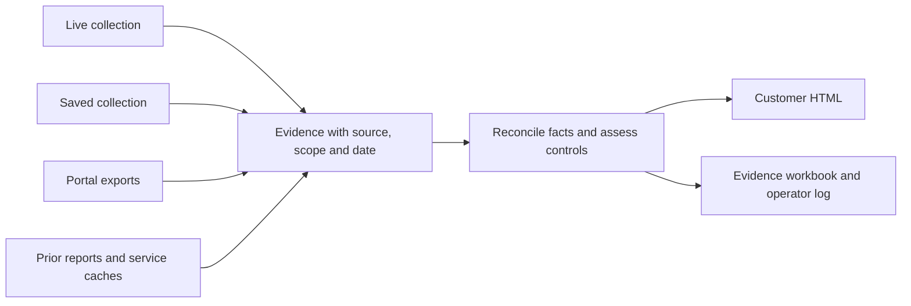

# Consolidated Copilot assessment redesign

> Historical redesign record, retained for context. Its instructions, paths and validation counts describe the work at that time. Use the [current documentation](../README.md) for operating the assessment.

Status: implementation and acceptance validation completed on 2026-09-15. See [validation results](ASSESSMENT_REDESIGN_VALIDATION.md). This document replaces a sequence of isolated presentation changes with one coordinated scope.

## Goal

Deliver a cohesive Microsoft 365 Copilot readiness assessment that business leaders and IT owners can understand and act on, supported by traceable evidence and a repeatable operator workflow: collect tenant evidence, add portal exports, and generate the same assessment offline.

The user confirmed the primary audience is business leaders and IT owners. Microsoft 365 Copilot is the core scope; agents and external AI are included when explicitly scoped. The technical workbook supports the customer report. Existing local evidence is the development baseline; this work does not require another tenant connection.

## What “full and complete” means

A complete deliverable addresses every agreed assessment domain, explains what the evidence supports, gives a prioritized action plan, and identifies the remaining decisions or checks. It does not require dumping every service-plan observation into the HTML.

Report completeness, evidence completeness, and readiness are separate:

- **Report completeness:** the agreed topics, findings, actions, qualifications, and supporting evidence are all covered.
- **Evidence completeness:** the required sources were assessed for the agreed population and period. Missing permissions, unsupported exports, stale evidence, and unassessed controls remain explicit.
- **Readiness:** the deployment recommendation supported by those findings and qualifications. A complete report can conclude that readiness has not yet been established.

Running offline is not itself a readiness failure. The age, relevance, reliability, and coverage of the evidence determine what can be concluded. Historical conclusions that cannot be validated from saved facts remain dated observations requiring confirmation.

## Problems the current output demonstrates

1. It leads with “Built offline,” cache filenames, and source mechanics before explaining the customer's position.
2. It appends an entire previous assessment and then shows a separate, largely empty current adoption section. Available historical usage is followed by “Not assessed” and wording suggesting Microsoft failed to return data even though no request occurred.
3. A missing current user inventory becomes zero in an appendix. Source absence must never be converted into a measurement.
4. Historical high-priority findings sit outside the main action plan, leaving the reader to reconcile old findings and new evidence.
5. SharePoint sharing configuration, permissions snapshots, lifecycle reporting, and sensitive-data exposure are conflated in broad missing-report messages.
6. Cached strengths and cached risks receive different presentation and confidence treatment. Undated evidence produces wording such as “Not established to Not established.”
7. Finding headings repeat export schema language and their own observations. The report follows collector and source boundaries more closely than customer questions.

These are evidence and assessment problems as well as editorial problems. A visual refresh alone will preserve the contradictions.

## Customer report design

Use one narrative with consistent domain sections:

1. **Executive assessment:** scope and evidence period, the supported deployment recommendation, principal concerns, and observed strengths. A reader should understand the position and first actions within two minutes.
2. **Prioritized action plan:** a single deduplicated register covering remediation and confirmation of unresolved historical findings. Each action identifies the condition, business significance, responsible role, rollout stage, and evidence of completion. Do not invent named owners or deadlines.
3. **Readiness by domain:** identity and access; content access and ownership; data protection; applications and connectors; endpoints and threat protection; Copilot licensing and prerequisites; pilot suitability and adoption. Include agents or external AI details only when in scope.
4. **Conditions for the next rollout stage:** what can proceed, what must be addressed or confirmed first, and what would justify expansion. Adoption opportunities must not be mistaken for security blockers.
5. **Remaining evidence and decisions:** the exact unanswered question, its effect on the recommendation, and who can close it. Explain licensing only where it affects an available control or a required decision.
6. **Technical appendix and workbook:** source lineage, dates and reporting windows, selected/superseded reports, rule identifiers, collection diagnostics, detailed inventories, and methodology.

Each domain uses the same short pattern: **what we know → why it matters → what to do → evidence and qualifications**. Integrate usable observations from different sources into that domain. Avoid a competing “previous report” narrative; keep the complete original register in the workbook.

Use natural, factual prose. For example:

> Assign owners to sites that have no accountable contact. Ask the responsible business teams to decide which inactive sites should be retained, restricted, or archived before expanding the pilot. The evidence workbook identifies the sites for review.

For historical findings:

> The earlier assessment identified identity controls requiring attention. Their remediation status has not been confirmed, so they remain in the action plan for validation.

Prefer action headings such as “Review broad access to SharePoint sites.” Define an acronym once when it matters. Describe internal sharing, external sharing, links, permissions, sites, users, and files with their actual units. Avoid an unexplained combined “exposure” total when its components overlap or measure different things.

Put source dates beside material claims and detailed provenance behind an evidence link. Keep CLI switches, cache paths, parser names, raw columns, and repeated processing disclaimers out of the main customer narrative. Use deterministic, reviewed wording templates; runtime generation must not require an external language-model service.

## Evidence and assessment design

All inputs should feed one shared representation before findings or customer summaries are built:



The shared evidence model needs tenant identity; domain/control and metric identifiers; affected objects or population; values and units; numerator/denominator and reporting window where relevant; original observation date; source type, file, schema and hash; completeness/truncation; freshness; and selection/conflict status.

Reconciliation rules must be explicit and tested:

- Select the latest suitable evidence only when tenant, scope, metric definition, and reporting basis are comparable. “Newest file” or “live source” alone is not sufficient.
- Treat tenant sharing settings, item permissions, lifecycle status, sensitivity inventories, and DSPM findings as different evidence questions.
- Keep missing, not requested, inaccessible, unsupported, empty, unknown, and measured zero distinct through the entire report pipeline.
- Apply the same freshness and support requirements to strengths and risks. A build timestamp does not refresh an observation.
- Do not sum repeated snapshots. Do not silently replace complete evidence with a narrower or incomplete source.
- Retain conflicting sources and unresolved historical findings with a specific confirmation action. Do not present an old recommendation as a newly verified tenant condition.
- Present one value per compatible metric/population/window, with its date and source. Historical usage can be useful even when there is no current observation.
- Separate technical prerequisites, license assignment, application readiness, actual Copilot usage, and security readiness. Included Copilot Chat and paid Copilot measures must remain identifiable.
- Derive the decision, domain summaries, action counts, strengths, and charts from one assessment result. Remove independent presentation rules that can disagree with it.
- Version the evidence format and methodology. For supported raw evidence, evaluate through the same rules in live and offline modes. Preserve legacy report conclusions as historical when their underlying facts cannot be reevaluated; do not silently mix old recommendation logic with new control scoring.

Every required in-scope control must have a supported result or a specific evidence gap. Optional or out-of-scope capabilities must not make the whole assessment incomplete. Unknown applicability must be disclosed rather than automatically passed.

## Operator workflow

Keep `--mode live|offline` as the main operator choice. Teach one normal path: **prepare → collect and save → add exports → rebuild and review**. Historical workbook/cache recovery is a documented fallback.

The following commands are supported today. Create the export folder first, use one tenant per folder, and run from the repository with its Python environment. These are operator examples, not commands to execute during the redesign.

```powershell
# 1. Validate access for the intended connected collection.
.\.venv\Scripts\python.exe main.py --mode live --check-connections

# 2. Collect tenant evidence and save it for reuse.
.\.venv\Scripts\python.exe main.py --mode live

# 3. Put the completed portal exports in the customer's exports folder,
# then use the saved collection path printed by the live run.
.\.venv\Scripts\python.exe main.py --mode offline `
  --collection-input ".\output\collections\<saved-file>.json" `
  --reports-dir ".\output\customer\exports" `
  --open-html-report
```

If exports already exist, add `--reports-dir ".\output\customer\exports"` to step 2. Start required Microsoft reports early because generation can take time; retain their completion date and selected scope. Today directory discovery is not recursive, so repeat `--reports-dir` for separate folders. Use `--interactive-auth fresh` when deliberately refreshing the existing interactive/cached collection path, following the operator guide.

Automatic collection saving is implemented: every live assessment saves `output/collections/tenant-collection_<tenant>_<UTC timestamp>_<unique id>.json` and prints its path plus an offline rebuild command. Replace `<saved-file>` in step 3 with that filename. `--save-collection PATH` remains an optional custom destination override. Preflight does not save a collection; offline mode does not save or overwrite one. Preserve this behavior in the consolidated redesign.

Today, a saved collection does not package every imported report or assessment setting. Preserve and resupply the original exports, profile/provider inputs, and relevant options when rebuilding. Reports currently appear under `Reports/`. The consolidated implementation must remove this dependence on operator memory.

Target package: one customer assessment folder containing a versioned collection/manifest, original reports, assessment settings, generated deliverables, and an operator log. Use relative source references and retain the original files needed to rebuild. Keep credentials outside the package. Reuse the existing CLI where practical; add options only when they remove a demonstrated operator burden.

The planned live path should extend automatic collection saving into a reproducible package, including downloaded report results and supplemental inputs used for that assessment. The offline path should load it, validate added reports, reconcile evidence, and render through the same assessment path. Operators should see a concise receipt listing tenant, original collection dates, accepted/superseded/rejected/unsupported inputs, remaining requirements, and output locations.

The operator guide must explain each requested report's purpose, portal steps, role/consent requirements, relevant licensing, expected delay, scope/date, and what to do when the report is unavailable. Confirm current Microsoft requirements against official documentation while implementing that guide. Keep a sample-validation matrix: supplied real export, documented/synthetic fixture only, or unsupported pending a sample. Missing samples must not be advertised as validated support.

## Implementation sequence for one coordinated effort

| Milestone | Work | Exit evidence |
|---|---|---|
| 1. Establish the baseline | Inventory current changes and fixtures; map report contradictions and required domains; capture the existing combined report and test baseline. | Agreed scope, a traceable defect list, representative preview inputs, and preserved prior work. |
| 2. Unify evidence and decisions | Introduce the shared evidence contract, reconciliation rules, domain results and action register; correct unknown-to-zero behavior and source-specific confidence inconsistencies. | Focused tests for dates, scope, duplicates, conflicts, missing evidence and historical findings; one consistent assessment result. |
| 3. Make collection and replay reproducible | Package inputs/settings/provenance, retain downloaded reports, align tenant validation, and evaluate supported saved facts through the same rules. | A copied package rebuilds offline; equivalent evidence/settings/methodology/evaluation date yield equivalent results in both modes. |
| 4. Redesign the customer report | Implement the agreed narrative, domain summaries, natural language, consistent counts, action plan and evidence links; preserve technical detail in the workbook. | Rendered previews pass both evidence review and editorial/visual review. No competing old/new report sections. |
| 5. Finish the operator handoff | Consolidate README/RUN/portal guidance, update methodology, publish working examples and report-request instructions, and run the acceptance checks. | One canonical runbook, tested commands, regenerated sample deliverables, and a documented list of genuine evidence limitations. |

Proceed through these milestones as one implementation effort. Do not require a new approval for each routine edit. Ask only for a material scope decision or information that cannot be inferred; continue independent work while waiting. If source data is unavailable, complete the supported work and record the precise limitation.

## Acceptance criteria

1. The opening page answers the deployment question, principal concerns, and next actions without exposing collection mechanics.
2. Every agreed domain is addressed. A reader can distinguish an observed problem, an unresolved historical finding, and a missing check.
3. One action register reconciles all sources. Counts in the summary, domain details, charts and workbook agree.
4. No unavailable metric appears as zero, and no section says Microsoft returned nothing when no request was made.
5. Cached strengths and risks follow the same source/date/scope rules; historical conclusions are not promoted solely because they were imported.
6. Missing source details do not cause unrelated evidence to disappear or an entire report family to be described as missing.
7. A package can move to another folder or machine and rebuild without its original cache/download paths, credentials, network calls, prompts, or administrative PowerShell.
8. Live and offline imports enforce the same tenant checks. No single foreign-tenant report bypasses comparison with the assessed tenant.
9. Equal evidence, settings, methodology and evaluation date produce equal findings and decisions, allowing only presentation timestamps/paths to differ. Later evaluation dates can legitimately change freshness and must be recorded.
10. All supplied inputs receive a useful import result; empty or unsupported files never silently establish assurance.
11. User-level Copilot detail remains opt-in for the evidence workbook and absent from HTML. Imported text is escaped and spreadsheet formulas remain inert.
12. Validate at least: the existing combined legacy/cache/export case; a complete synthetic saved collection plus reports; portal-only evidence; stale, conflicting, empty and superseded inputs; and tenant mismatch.
13. Review rendered HTML at desktop and narrow widths, verify workbook evidence links, and perform a human-style editorial pass for duplicated content, unexplained acronyms, contradictory claims, and mechanical language. Automated tests alone are not the completion criterion.
14. README, RUN, methodology and the portal guide describe the same supported workflow and decision rules. Every example command is checked against the implemented CLI.

## Constraints and scope control

Preserve existing uncommitted work and supported commands. Use current tenant artifacts only in ignored local output locations; committed fixtures must use invented or appropriately sanitized data. Do not connect to the tenant, start Microsoft scans, change policies, send customer messages, purchase licensing, or add an external runtime service during this implementation unless separately requested.

Avoid adding new collectors merely to make the report longer. Do not manufacture unavailable DSPM/sharing-activity evidence or turn a lack of licensing into a confirmed security failure. Defer unrelated product expansion and use explicit scope for agents/external AI.

Known implementation risks to resolve include the separate decision logic in the renderer, incomplete packaging of supplemental inputs, failure to pass the live tenant ID into report validation, and the combination of precomputed legacy recommendations with newer assessment rules. Start with these structural issues, then finish the customer presentation.
